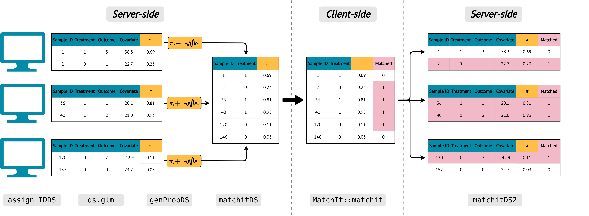

```{r setup, include = FALSE}
knitr::opts_chunk$set(
  collapse = TRUE,
  comment = "#>"
)
```


This is an introduction to dsMatchingClient package for use within the DataSHIELD infrastructure. Please make sure you are familiar with DataSHIELD and DSLite before proceeding. This example is based off of the MatchIt package example described [here](https://cran.r-project.org/web/packages/MatchIt/vignettes/assessing-balance.html)

# Setup and Log in
```{r results='hide', message=FALSE, warning=FALSE}
# Install the current version of both the client and server packages found locally
# devtools::install("../dsMatching")
# devtools::install("../dsMatchingClient")

# Load all the required packages
library(dsBase)
library(dsBaseClient)
library(DSLite)
library(dsMatching)
library(dsMatchingClient)

library("MatchIt")

# set seed
seed_num <- 741
set.seed(seed_num)
```

Extract the Lalonde dataset and split it into three different chunks to mimic different harmonised server nodes
```{r}
# real data
data("lalonde")

# prepare test data in a light DS server
split_it <- function(df){
  df1 <- df[1:50,]
  df2 <- df[51:200,]
  df3 <- df[201:dim(df)[1],]

  return(list("df1" = df1, "df2" = df2, "df3" = df3))
}
shuffled_lalonde <- lalonde[sample(1:nrow(lalonde)), ]
sp <- split_it(shuffled_lalonde)
lalonde1 <- sp$df1
lalonde2 <- sp$df2
lalonde3 <- sp$df3

```

Log into DSLite servers and upload Lalonde dataset chunks
```{r results='hide', message=FALSE, warning=FALSE}
# Create virtualized server with DSLite, assign everything needed on it
cfg <- DSLite::defaultDSConfiguration(include=c("dsBase", "dsMatching"))
cfg$Options$default.datashield.privacyControlLevel <- "\"permissive\""
cfg$Options$default.nfilter.glm <- "1"

dslite.server <- newDSLiteServer(tables=list(lalonde1=lalonde1, lalonde2=lalonde2, lalonde3=lalonde3),
                                 config = cfg)

builder <- DSI::newDSLoginBuilder()
builder$append(server = "server1", url = "dslite.server", table = "lalonde1", driver = "DSLiteDriver")
builder$append(server = "server2", url = "dslite.server", table = "lalonde2", driver = "DSLiteDriver")
builder$append(server = "server3", url = "dslite.server", table = "lalonde3", driver = "DSLiteDriver")

logindata.dslite <- builder$build()

# Login to the virtualized server
connections <- datashield.login(logindata.dslite, assign=T)

DSI::datashield.assign.table(conns = connections, symbol = "DST", table = c("lalonde1","lalonde2", "lalonde3"))

# set seed
empt <- ds.setSeed(seed.as.integer = seed_num, datasources = connections)
```

Set matching parameters
```{r}
# formula to handle
f_text <- "treat ~ age + educ + married + nodegree + re74 + re75"

meth <- "nearest"
m.order <- "smallest"
ratio <- 1
replace <- F
tol = 1e-7
discard = "both"
```
# Matching
## Centralised Matching

Use the Matchit package with the specified parameters.
```{r}
# normal matching
norm_match <- matchit(formula = formula(f_text),
                      data = shuffled_lalonde,

                      ratio = ratio,
                      method = meth,
                      m.order = m.order,
                      replace = replace,
                      tol = tol,
                      discard = discard)
```

Now using the federated DataShield package. Here, we are adding normally distributed noise (with standard deviation equal to 0.3) to the propensity scores. We create a new matched object "matched_pool"
## Federated Matching
```{r results='hide', message=FALSE, warning=FALSE}
fed_match <- ds.matchit(form = f_text,
                        data = "DST",
                        privacy = "norm",
                        sd = 0.3,
                        # k = k,
                        newobj = "matched_pooled",

                        method = meth,
                        m.order = m.order,
                        ratio = ratio,
                        replace = replace,
                        tol = tol,
                        discard = discard)
```

# Summary

Get summary statistics after the matching is done to see how good the matching procedure went with the additive noise to the propensity scores. Note that the corresponding domain of the eCDF cannot be provided as this is disclosive. As a result, the eCDF mean and maximum results are an approximation of the true results by construction and equidistance domain.

## Centralised
```{r}
# summary of unmatched/matched results
norm_summary <- summary(norm_match, un = T, improvement = T)
```
## Federated
```{r}
fed_summary.combined <- ds.match_summary(unmatched_obj = "DST",
                                         matched_obj = "matched_pooled",
                                         type = "combined",
                                         bin_num = 429,
                                         treatment = "treat")
```

### Comparing

#### All Data

*Centralised:*
```{r, echo=FALSE, results='asis'}
knitr::kable(norm_summary$sum.all)
```

*Federated:*
```{r, echo=FALSE, results='asis'}
knitr::kable(fed_summary.combined$`Summary of Balance for All Data:`)
```

#### Matched data

*Centralised:*
```{r, echo=FALSE, results='asis'}
knitr::kable(norm_summary$sum.matched)
```

*Federated:*
```{r, echo=FALSE, results='asis'}
knitr::kable(fed_summary.combined$`Summary of Balance for Matched Data:`)
```

#### Percentage Improvement

*Centralised:*
```{r, echo=FALSE, results='asis'}
knitr::kable(norm_summary$reduction)
```

*Federated:*
```{r, echo=FALSE, results='asis'}
knitr::kable(fed_summary.combined$`Percent Balance Improvement:`)
```

# Plotting

## Love Plots

Visually show before/after matching standard differences between different variables.

```{r fig.show='hold'}
# love plot
cent_love_plot <- plot(norm_summary)

fed_love_plot <- love.plot(fed_summary.combined)
fed_love_plot
```


## eQQ Plots

Ensure quantile-quantile plots are similiar
```{r fig.show='hold'}
# plots
which.xs <- treat ~ age + re74 + re75

# qq plot
cent_qq_plot <- plot(norm_match,
                     type = "qq",
                     which.xs = which.xs)

fed_qq_plot <- ds.qq_plot(unmatched = "DST",
                          matched = "matched_pooled",
                          formula = which.xs)
```

## eCDF Plots

As mentioned before, the step function of the eCDF is not exact but an approximation by construction of a domain
```{r fig.show='hold'}
# eCDF plot
cent_eCDF_plot <- plot(norm_match,
                       type = "ecdf",
                       which.xs = which.xs)

fed_eCDF_plot <- ds.eCDF_plot(unmatched = "DST",
                              matched = "matched_pooled",
                              formula = which.xs)

```


Log out
```{r}
# log out
DSI::datashield.logout(connections)
```
